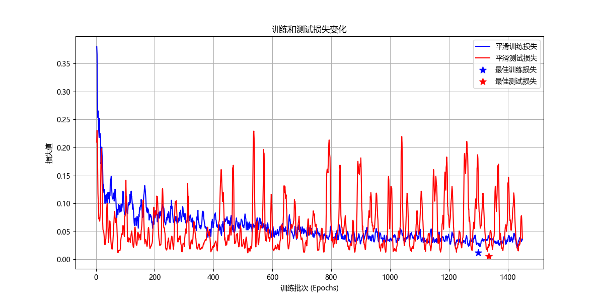
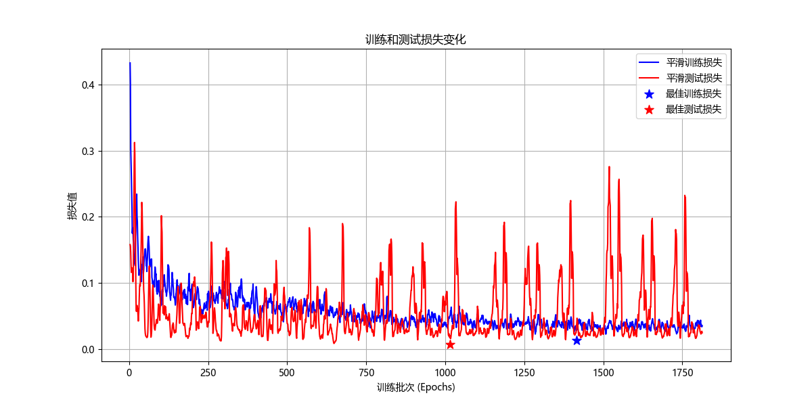
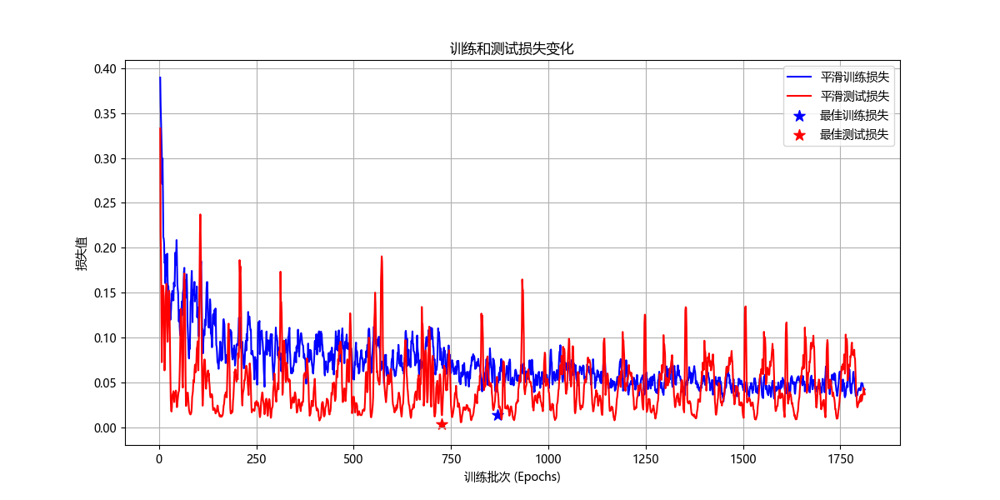
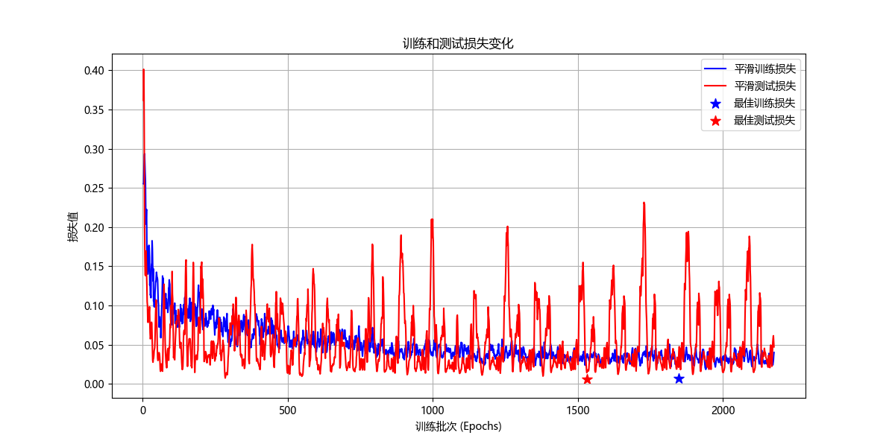

脚本形参：
```shell
--model informer --data QianTangRiver2020-2024WorkedFull --attn prob --freq h --device 0
```

## 记录

### 2025/2/19

|          | 训练轮数 | best train loss   | best test loss    |
| -------- | -------- |-------------------|-------------------|
| resource | 1452     | 0.0122 (第 1299 轮) | 0.0056 (第 1336 轮) |
| RNN      | 1815     | 0.0128 (第 1415 轮) | 0.0067 (第 1015 轮) |
| GRU      | 1815     | 0.0135 (第 870 轮)  | 0.0035 (第 726 轮)  |
| LSTM     | 2178     | 0.0068 (第 1847 轮) | 0.0068 (第 1847 轮) |


#### resource

&nbsp;&nbsp;&nbsp;&nbsp;总训练轮数: 1452
&nbsp;&nbsp;&nbsp;&nbsp;训练损失最优值: 0.0122 (第 1299 轮)
&nbsp;&nbsp;&nbsp;&nbsp;测试损失最优值: 0.0056 (第 1336 轮)



#### RNN

&nbsp;&nbsp;&nbsp;&nbsp;总训练轮数: 1815
&nbsp;&nbsp;&nbsp;&nbsp;训练损失最优值: 0.0128 (第 1415 轮)
&nbsp;&nbsp;&nbsp;&nbsp;测试损失最优值: 0.0067 (第 1015 轮)



#### GRU
&nbsp;&nbsp;&nbsp;&nbsp;总训练轮数: 1815
&nbsp;&nbsp;&nbsp;&nbsp;训练损失最优值: 0.0135 (第 870 轮)
&nbsp;&nbsp;&nbsp;&nbsp;测试损失最优值: 0.0035 (第 726 轮)



#### LSTM

&nbsp;&nbsp;&nbsp;&nbsp;总训练轮数: 2178
&nbsp;&nbsp;&nbsp;&nbsp;训练损失最优值: 0.0068 (第 1847 轮)
&nbsp;&nbsp;&nbsp;&nbsp;测试损失最优值:0.0068 (第 1847 轮)


